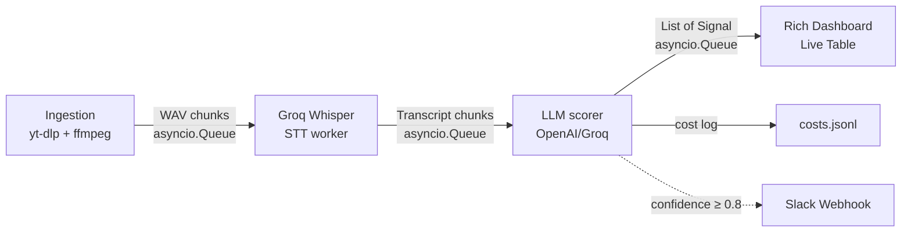

# Commodity Sentiment Monitor

Real-time commodity sentiment analysis pipeline that extracts speech from audio streams, identifies commodity-relevant topics, and scores their probable market impact direction and intensity.

Tracked commodities: WTI crude, Brent crude, natural gas, gold, silver, wheat, corn, copper.

## Architecture



The pipeline is built as three async workers connected by `asyncio.Queue`:

1. **Ingestion** — Accepts a live stream URL (via yt-dlp: YouTube, Twitch, HLS, RTMP) or a local MP4 file. Audio is segmented into configurable-length WAV chunks (default 10s, 16 kHz mono) via ffmpeg. Live mode includes auto-reconnect with exponential backoff on stream failure. File mode runs as fast as possible by default; set `FILE_MODE_REALTIME=true` to simulate live pacing for demos.
2. **STT** — Each chunk is transcribed via the Groq Whisper API (`whisper-large-v3-turbo`) with word-level timestamps.
3. **LLM Scoring** — The transcript is analyzed using structured tool calling (OpenAI GPT-4o-mini by default, or Groq Llama 3.3). The model acts as a commodity analyst, extracting signals with direction, confidence, timeframe, and rationale. In this implementation, `confidence` serves as the practical proxy for impact intensity: higher confidence corresponds to a stronger expected directional move.
4. **Dashboard** — Signals are displayed in a Rich terminal table, refreshing on each new signal.

## Quickstart

```bash
# 1. Clone and enter the repo
git clone <repo-url>
cd commodity-sentiment-monitor

# 2. Copy env and fill in API keys
cp .env.example .env
# Edit .env: add GROQ_API_KEY for Whisper STT and OPENAI_API_KEY for default scoring
# Optional: switch scorer to Groq via LLM_PROVIDER=groq

# 3a. Run with a local MP4 file
cp your_broadcast.mp4 fixtures/sample_stream.mp4
docker compose up

# 3b. OR run with a live stream URL
STREAM_URL="https://www.youtube.com/watch?v=LIVE_ID" docker compose up
```

### Running Locally (without Docker)

```bash
uv sync
# File mode
uv run python -m app.main
# Live mode (yt-dlp installed via uv as dependency)
STREAM_URL="https://youtube.com/watch?v=..." uv run python -m app.main
```

### Running Evaluation

```bash
docker compose run app uv run python -m app.eval.run
# Output: eval_report.md with accuracy, confusion matrix, misclassifications
```

## Configuration

| Variable | Required | Description |
|---|---|---|
| `GROQ_API_KEY` | Yes | Groq API key for Whisper STT |
| `OPENAI_API_KEY` | Yes | OpenAI API key for GPT-4o-mini scoring |
| `LLM_PROVIDER` | No | `openai` (default) or `groq` |
| `LLM_MODEL` | No | Model ID (default: `gpt-4o-mini`) |
| `STREAM_URL` | No | Live stream URL (YouTube, Twitch, HLS, RTMP). If set, overrides INPUT_FILE. |
| `INPUT_FILE` | No | Path to local MP4 (default: `fixtures/sample_stream.mp4`). Used when STREAM_URL is empty. |
| `CHUNK_DURATION` | No | Audio chunk length in seconds (default: `10`) |
| `FILE_MODE_REALTIME` | No | If `true`, local file mode sleeps between chunks to mimic a live stream (default: `false`) |
| `SLACK_WEBHOOK_URL` | No | Slack webhook — sends alerts when signal confidence ≥ 0.8 |
| `STT_LANGUAGE` | No | Whisper language code (default: `en`). Set to `cs` for Czech. |
| `ENABLE_DIARIZATION` | No | Enable pause-based speaker diarization (default: `true`) |

## Design Decisions

### Why Groq Whisper API (not local Whisper)

Local Whisper requires CUDA setup in Docker, which adds significant image size and build complexity. The Groq API provides the same `whisper-large-v3-turbo` model with word-level timestamps at ~$0.04/hour of audio — well within the $10 budget even for extensive testing.

### Why GPT-4o-mini + Structured Tool Calling

Entity extraction, impact scoring, and person/indicator identification are combined into a single LLM call using OpenAI's function calling. This avoids string parsing and guarantees a structured JSON response matching the `Signal` Pydantic model. GPT-4o-mini was chosen for its excellent cost/quality ratio ($0.15/$0.60 per M tokens) — a 10-second transcript chunk costs ~$0.0001 to analyze. Groq Llama 3.3 is supported as an alternative provider via `LLM_PROVIDER`.

### Retry & Resilience

All API calls (Groq Whisper, OpenAI/Groq LLM) and ffmpeg operations include exponential backoff retry (3 attempts, 1s/2s/4s delays). A single chunk failure does not crash the pipeline — the worker logs the error and continues with the next chunk.

### Slack Webhook

When `SLACK_WEBHOOK_URL` is set, any signal with confidence ≥ 0.8 triggers a Slack notification with commodity, direction, confidence, rationale, and quote.

### Multi-Language

Set `STT_LANGUAGE=cs` for Czech transcription. Whisper supports 90+ languages via the language code parameter.

### Speaker Diarization

Pause-based speaker segmentation using word-level timestamps from Whisper. A pause > 1.5 seconds is treated as a turn boundary and the code assigns alternating placeholder labels (`SPEAKER_0`, `SPEAKER_1`). This is a lightweight proxy, not true speaker identification, but it still gives the LLM cleaner turn structure in interviews and Q&A. For production use, this should be replaced with pyannote-audio or a cloud API (Deepgram, AssemblyAI) without changing the rest of the pipeline.

### Why Rich Terminal (not FastAPI + SSE)

A terminal dashboard eliminates the need for a web server, frontend build, and browser. Rich's `Live` display provides a clean, real-time table that works over SSH and in Docker containers with `tty: true`. For a demo, this provides the fastest path to a working visualization.

## Cost Analysis

### Default Stack: Groq Whisper + GPT-4o-mini

| Component | Service | Unit Cost | Cost/Hour |
|---|---|---|---|
| STT | Groq Whisper Large v3 | $0.00 (free tier) | $0.00 |
| LLM | OpenAI GPT-4o-mini (input) | $0.15/M tokens | $0.011 |
| LLM | OpenAI GPT-4o-mini (output) | $0.60/M tokens | $0.032 |
| **Total** | | | **~$0.04/hour** |

**Estimated total for $10 budget: ~250 hours of continuous monitoring.**

### Alternative Providers

| Provider | Model | Cost/Hour | Notes |
|---|---|---|---|
| Groq (free) | Llama 3.3 70B | $0.00 | Rate-limited (100K tokens/day) |

Switch provider via `LLM_PROVIDER` and `LLM_MODEL` env vars. All API costs are logged to `costs.jsonl`.

### Actual Measured Costs

Based on real API usage during development and evaluation:

| Operation | Cost |
|---|---|
| Single 10s chunk (STT + LLM) | ~$0.0003 |
| Eval suite (10 cases) | ~$0.003 |
| 30 minutes live stream (~180 chunks) | ~$0.05 |
| **Total project spend (dev + eval + testing)** | **$0.03** |

**Well within the $10 budget** — the entire project cost approximately $0.03 in API calls.

## Evaluation

The evaluation harness (`src/app/eval/run.py`) tests the LLM scorer against labeled transcript excerpts. The fixture file `fixtures/eval_cases.json` contains 10 representative cases based on real-world financial broadcast scenarios and labels behavior separately as `empty`, `neutral_signal`, or `directional`:

- OPEC production cuts (bullish oil)
- Fed hawkish/dovish signals (bearish/bullish gold)
- Crop damage reports (bullish wheat)
- Iran sanctions (bullish Brent)
- Weak China demand (bearish copper)
- Warm winter forecasts (bearish natural gas)
- Silver industrial demand (bullish silver)
- Neutral chitchat (no signal)
- Ambiguous mixed signals (neutral)

All 10 cases include representative transcripts ready for evaluation. Run with:

```bash
docker compose run app uv run python -m app.eval.run
```

## Backtesting (yfinance)

The `backtest` module compares predicted signal directions against actual commodity price movements using Yahoo Finance historical data.

```python
from app.backtest.yfinance_check import backtest_signals, backtest_report
from datetime import datetime

# After collecting signals from the pipeline:
results = backtest_signals(signals, signal_date=datetime(2024, 11, 30))
backtest_report(results, "backtest_report.md")
```

Ticker mapping: WTI → `CL=F`, Brent → `BZ=F`, Gold → `GC=F`, Silver → `SI=F`, Nat Gas → `NG=F`, Wheat → `ZW=F`, Corn → `ZC=F`, Copper → `HG=F`.

## Technical Document

See [TECHNICAL_DOC.md](TECHNICAL_DOC.md) for a detailed architecture overview, design trade-offs, production improvement roadmap (scalability, SLA, monitoring, security), and evaluation methodology.

## Demo

To record a demo: `asciinema rec demo.cast` while running `docker compose up`, then `asciinema play demo.cast` to replay.

A ready-to-record walkthrough script is available in [DEMO_VIDEO_SCRIPT.md](DEMO_VIDEO_SCRIPT.md).

## Known Limitations

See [KNOWN_LIMITATIONS.md](KNOWN_LIMITATIONS.md).

## What I'd Do With More Time

- **Neural diarization** — replace pause-based heuristic with pyannote-audio or Deepgram for higher accuracy
- **Prometheus metrics** — expose pipeline latency, signal count, and cost metrics
- **Persistent queue** — use Redis or similar for crash recovery between pipeline stages
- **Kubernetes deployment** — horizontal scaling of STT and LLM workers
- **Confidence calibration** — post-hoc calibration using historical accuracy data
- **RAG-lite context layer** — retrieve recent chunk summaries plus a small curated commodity knowledge base to improve implicit macro reasoning and mixed-signal cases
- **spaCy support layer** — add lightweight prefiltering and entity normalization before LLM scoring to reduce noise and API spend
- **Graceful shutdown** — proper drain of in-flight chunks on SIGTERM
- **Streaming overlap** — overlapping audio windows to avoid cutting sentences at chunk boundaries

## AI Assistance Disclosure

An AI programming assistant was used throughout the development of this project for code generation, architecture design, prompt engineering, and documentation writing.
